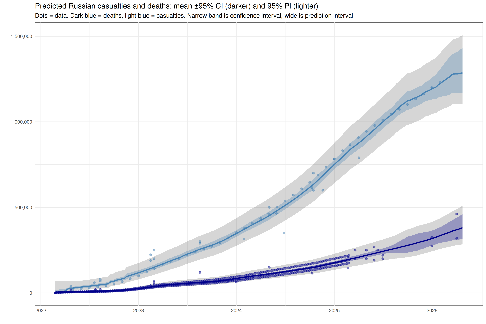

# Meta-estimates of dead and wounded in the Russia-Ukraine war (2022-)

<!-- ESTIMATES-START -->

## Live estimates

As of **2025-07-09**:
- Estimated deaths: **190,000** to **348,000** (or, roughly **257,000**)
- Estimated casualties: **900,000** to **1,340,000** (or, roughly **1,098,000**)

<!-- ESTIMATES-END -->



A R script aggregates a public and leaked intelligence estimates of military casualties and deaths in the Russia–Ukraine war, fits a GAM (using **mgcv**), and outputs both data and a combined plot of predicted casualties and dead. It currently only predicts dead and casualties for the Russian side, as there are not enough credible public estimates of Ukrainian fallen to produce meta-estimates.

## Prerequisites
- **R** ≥ 4.0  
- R packages: `tidyverse`, `lubridate`, `mgcv`, `scales`, `zoo` 

## Data Layout
```

scripts/
└─ meta\_estimate.R

source-data/
├─ Soldier\_deaths\_casualties\_estimates.csv
├─ UK\_MoD\_monthly\_estimates.csv
├─ meduza\_2024.csv
├─ meduza\_2025\_weekly.csv
├─ strikes\_by\_location\_and\_day.csv
└─ area\_assessed\_as\_controlled.csv

output-data/
├─ meta-estimate-casualties.csv
└─ meta-estimate-deaths.csv

plots/
└─ meta-estimate.png

````

## Usage
```bash
Rscript scripts/meta_estimate.R
````

* Halts if no data newer than 3 months is found
* Generates CSVs in `output-data/` and plot in `plots/`

## Workflow

1. **Load & clean** multiple source CSVs
2. **Merge** estimates (deaths vs. casualties)
3. **Load covariates** (fires, cloud cover, territory changes)
4. **Fit GAM** with splines & tensor terms
5. **Predict** through today, calculate 95 % CI & PI
6. **Export** CSVs & save plot

## Outputs

* `output-data/meta-estimate-casualties.csv`
* `output-data/meta-estimate-deaths.csv`
* `plots/meta-estimate.png`

