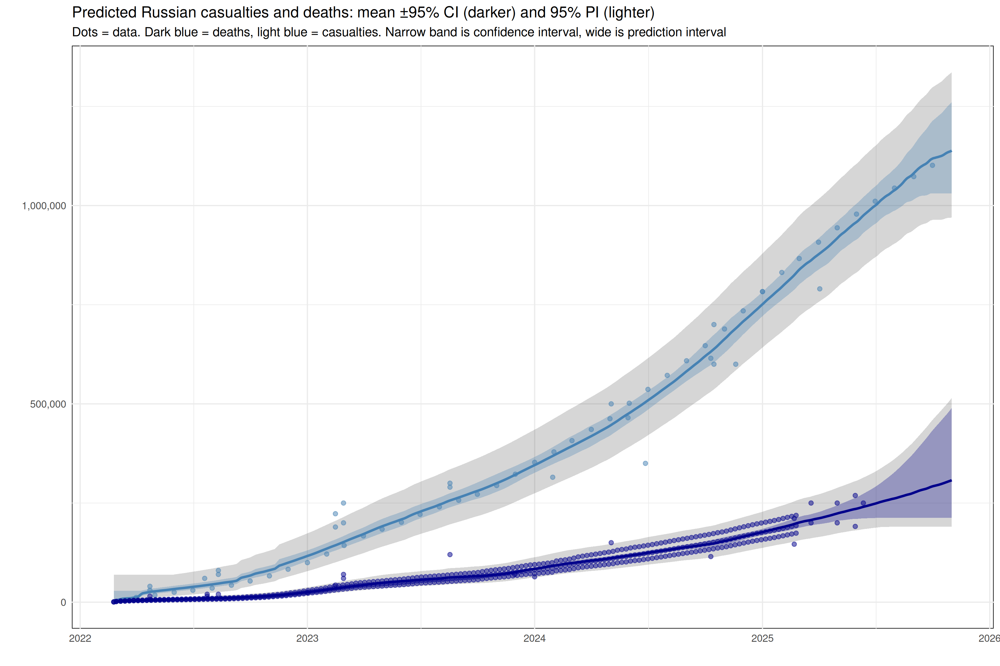

# Meta-Estimate of Russian Casualties & Deaths

A concise R script that aggregates public estimates of military casualties and deaths in the Russia–Ukraine war, fits a GAM (using **mgcv**), and outputs both data and a combined plot.

## Prerequisites
- **R** ≥ 4.0  
- R packages: `tidyverse`, `lubridate`, `mgcv`, `scales`

## Data Layout
```

scripts/
└─ meta\_estimate.R

source-data/
├─ Soldier\_deaths\_casualties\_estimates.csv
├─ UK\_MoD\_monthly\_estimates.csv
├─ meduza\_2024.csv
├─ meduza\_2025\_weekly.csv
├─ strikes\_by\_location\_and\_day.csv
└─ area\_assessed\_as\_controlled.csv

output-data/
├─ meta-estimate-casualties.csv
└─ meta-estimate-deaths.csv

plots/
└─ meta-estimate.png

````

## Usage
```bash
Rscript scripts/meta_estimate.R
````

* Halts if no data newer than 3 months is found
* Generates CSVs in `output-data/` and plot in `plots/`

## Workflow

1. **Load & clean** multiple source CSVs
2. **Merge** estimates (deaths vs. casualties)
3. **Load covariates** (fires, cloud cover, territory changes)
4. **Fit GAM** with splines & tensor terms
5. **Predict** through today, calculate 95 % CI & PI
6. **Export** CSVs & save plot

## Outputs

* `output-data/meta-estimate-casualties.csv`
* `output-data/meta-estimate-deaths.csv`
* `plots/meta-estimate.png`

